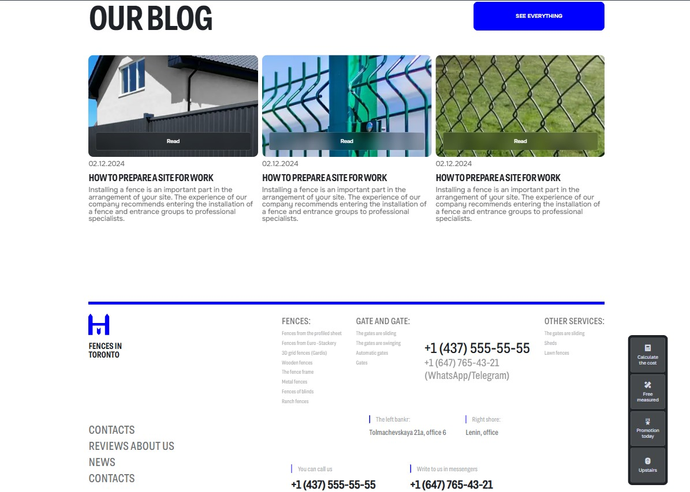
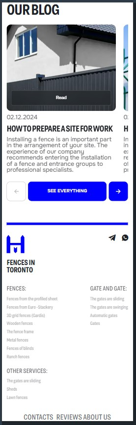

# Zabor Mark — One-Page Website Demo

A one-page responsive (fluid) website demo, created as a front-end portfolio project from a Figma mockup.

**Demo:** https://zhuridochka.github.io/Zabor_Mark_demo/home.html

## Screenshots

| Desktop | Mobile |
|---|---|
|  |  |

## Features
- Fluid layout, adapts to any screen width
- Floating additional menu
- Double sliders
- Contact form
- Spoilers (accordion)
- "Show more" blocks
- Complex multi-column footer

## Tech stack
HTML5, CSS3, JavaScript

## Run locally
Clone the repository and open `index.html` in your browser.
